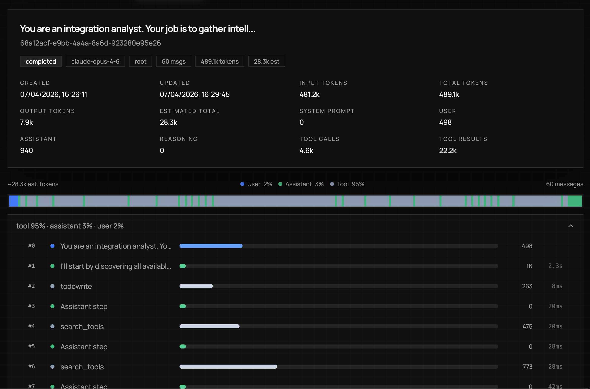
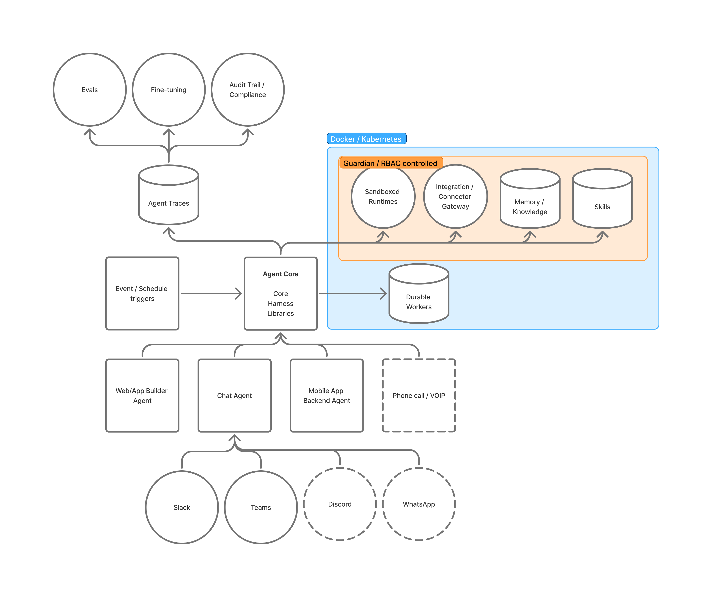

# nalvin

An open-source agent harness built in Go, designed for **finetuning small models into capable agents**.

nalvin gives any OpenAI-compatible model a rich tool environment — file I/O, Docker containers, Git repos, a knowledge base, MCP integrations, sub-agents — and manages the hard parts of long-running agentic tasks (context overflow, giant tool results, multi-agent orchestration). Every agent run is recorded as a detailed trace in SQLite, producing structured training data that captures tool call sequences, parallel execution patterns, error recovery, and multi-step reasoning.

The goal: run a frontier model (Claude, GPT) and a small local model (Qwen 3.5 4B/9B) on the same tasks, then use the frontier traces to finetune the small model until it matches or exceeds the frontier model's agentic behavior — at a fraction of the cost. See the [finetuning plan](docs/finetuning-plan-qwen3.5-agent-behavior.md) for the full approach, including a [three-model comparison](docs/integration-test-glm5.1-vs-qwen3.5-35b-vs-opus4.6.md) that identifies the exact behavioral gaps to close.

Built on [charm.land/fantasy](https://charm.land), the Charm CLI model-interaction library.





## Why nalvin

Most agent harnesses give the model a `run_shell` tool and hope for the best. nalvin takes a different approach:

- **No host shell execution.** The agent cannot run arbitrary commands on your machine. All command execution happens inside Docker containers via `docker exec`. This is fundamentally safer than harnesses that hand the model a shell on the host.
- **Programmatic tool calling via a cross-platform shell.** Instead of host exec, nalvin provides a POSIX shell environment where every agent tool is a command. The shell is powered by [mvdan/sh](https://github.com/mvdan/sh), a pure-Go POSIX interpreter — it works identically on macOS, Linux, and Windows with no system shell dependency. Tools become composable: `glob --pattern "*.go" | jq -r '.paths[]' | head -20`.
- **Tool search, not tool dumps.** Rather than sending dozens of tool definitions to the model on every turn, nalvin keeps most tools hidden and provides a `search_tools` command backed by FTS5. The model discovers tools by describing what it needs. This keeps prompt size small and scales to large tool catalogs.
- **Tool output spillover.** When a tool returns a huge result (a large file, a long web page), the runtime stores the full output in SQLite and sends the model a compact summary with an `output_id`. The model can then page through or grep the stored output on demand, without blowing up context.
- **Conversation compaction.** Long runs are automatically summarized when they approach the context window limit. The runtime summarizes older messages into a structured checkpoint, preserving references to spilled tool outputs, and keeps recent turns intact. Compaction is incremental — each round folds into the previous checkpoint.
- **Multiple local workspaces.** Each workspace is a directory plus a SQLite database. The database stores agent runs, a knowledge graph (nodes + edges with FTS and embedding columns ready for vector search / reciprocal rank fusion), scheduler state, and tool output history. Switch between workspaces with a flag.
- **First-class sub-agents.** Inspired by [codex-rs](https://github.com/openai/codex), nalvin supports spawning child agents with independent conversation histories and tool selections. The parent communicates through `spawn_agent`, `send_input`, `wait_agent`, and `close_agent`. Children are persisted as linked run records and can use a different provider than the parent.
- **Custom tools via embedded Go interpreter.** Drop a `.go` file in `~/.nalvin/custom-tools/` and it becomes a tool. Files are compiled at runtime by the embedded [Scriggo](https://scriggo.com) interpreter. Custom tools can call any other tool via `tool.CallTool()`, appear in `search_tools`, and work in the shell — no rebuild required.
- **Skills system.** A skill is a `SKILL.md` (plus optional scripts and references) that activates on demand to teach the agent a specific workflow. Activation injects the skill body into the system prompt, optionally autoreveals tools, and can run scripted commands in a sandboxed container via `skill_exec`. Skills come from three layers: bundled (compiled into the binary), workspace (`<workspace>/.nalvin/skills/`), and user (`~/.nalvin/skills/`). The `skill://` URL scheme lets the agent read a skill's bundled resources through normal file tools.

## Quick Start

### Prerequisites

- Go 1.26+
- [Bun](https://bun.sh) (for the web frontend and dev scripts)
- Docker (optional, for container tools)

### Install

```bash
git clone https://github.com/versionlens/OpenNalvin.git
cd OpenNalvin
go mod tidy
bun install
```

### Building

The project uses a Makefile that passes the required `-tags sqlite_fts5` build tag automatically:

```bash
make build          # Build web frontend + Go binary
make build-api      # Go binary only
make build-web      # Web frontend only
make test           # Run all tests (Go + web)
make test-go        # Go tests only
make dev            # API + web with hot reload
make cli ARGS="--workspace myproject agent run -p 'hello'"
```

All `make` targets set `GOFLAGS=-tags=sqlite_fts5` so you don't need to specify it manually. If you run `go` commands directly, remember to pass `-tags sqlite_fts5`.

### Configure a provider

Create `~/.nalvin/config.yaml` with one or more providers. The `default` provider is used unless you specify `--provider <name>`:

```yaml
providers:
  default:
    type: openai
    api_key: ${OPENAI_API_KEY}
    model: gpt-5.4
    context_window_tokens: 128000

  claude:
    type: anthropic
    api_key: ${ANTHROPIC_API_KEY}
    model: claude-sonnet-4-6
    context_window_tokens: 200000
```

Three provider types are supported:

| Type | Description |
|------|-------------|
| `openai` | OpenAI API (default if `type` is omitted and no `base_url` is set) |
| `anthropic` | Anthropic API |
| `openai_compat` | Any OpenAI-compatible API (requires `base_url`) |

For local servers like LM Studio, Ollama, llama.cpp, or vLLM:

```yaml
providers:
  local:
    base_url: http://localhost:1234/v1
    model: local-model
    context_window_tokens: 32000
```

Use a specific provider for a run:

```bash
nalvin --workspace myproject agent run --provider claude -p "Summarize all files in the workspace"
```

### Working with local models

Local models vary widely in tool-calling reliability. nalvin includes several features that help smaller models succeed at multi-step tasks:

- **Tool discovery via `search_tools`** keeps the visible tool set small, reducing prompt size and model confusion. Only a handful of tools are pinned (visible from the start); the rest are discovered on demand.
- **Todo-based continuation** — when the model creates a todo list with `todowrite` but stops before completing all items, the runtime automatically nudges it to continue (up to 5 retries). Each nudge names the specific incomplete todo item and instructs the model to act immediately. This compensates for local models that emit premature stop tokens mid-task.
- **System prompt tuning** — the base system prompt includes a numbered workflow (`todowrite` → `search_tools` → do work → update todos) and a concrete example, both designed to guide smaller models through multi-step tasks.

For model-specific setup guides, see:

- [Running Qwen 3.5 with llama.cpp](docs/local-model-qwen3.5-llamacpp.md)

### Create a workspace and run the agent

The agent can only see files inside its workspace directory (`~/.nalvin/workspaces/<name>/`). It does not have access to your host filesystem, your current directory, or any path outside the workspace. To work with existing files, copy them into the workspace first.

```bash
# Create a workspace
nalvin workspace create myproject

# Copy files into it
nalvin --workspace myproject workspace put ./my-notes.md notes.md

# Run the agent
nalvin --workspace myproject agent run -p "What tools do you have available? Use search_tools to find out."

# Run with verbose output to see tool calls
nalvin --workspace myproject agent run --verbose -p "List the files in the workspace and summarize them"
```

### See results in the web UI

```bash
# Start the API server and web frontend
bun run dev

# Or start them separately
bun run dev:api   # Go API on :4210
bun run dev:web   # Vite dev server on :4211, proxies /api to Go
```

Open `http://localhost:4211` to browse agent runs, inspect tool calls, view spilled outputs, and start new conversations.

### Cross-platform frontend (experimental)

There is an experimental Flutter-based client at [VersionLens/OpenNalvin_app](https://github.com/VersionLens/OpenNalvin_app). It is not production-ready and exists to explore what a cross-platform client for OpenNalvin could look like across iOS, Android, macOS, Linux, and Windows.

## Architecture

### Skills

A **skill** is a Markdown file (`SKILL.md`) plus optional scripts and references that teaches the agent a specific workflow. When a skill is active, its body is injected into the system prompt and any `autoreveal_tools` it lists become visible to the model without going through `search_tools`.

Skills are the agent's **first stop** for figuring out how to approach a task. The intended priority is:

1. **Active skills** — system-activation skills are always on; manual skills can be activated by the user (`--skill <name>`), by config (`agent.skills.default_active`), or by the agent itself mid-run via the `skill` tool when a relevant one is found.
2. **Skill search** — `agent skills list` / `agent skills search` for the model to discover a workflow that already encodes how to approach the task (and which tools to reach for).
3. **Tool search** — fall back to `search_tools` only when no skill covers the task and the autorevealed tool set is insufficient.

Skills are loaded from three layers (later wins):

1. **Bundled** — compiled into the binary under `internal/agent/skills/`.
2. **Workspace** — `<workspace>/.nalvin/skills/<name>/` for skills shared with a specific project.
3. **User** — `~/.nalvin/skills/<name>/` for skills available across all workspaces.

The bundled set covers the common workflows a coding agent needs:

| Skill | Activation | Purpose |
|-------|------------|---------|
| `execution-discipline` | system | Keep execution literal, concise, and scoped to the user's requested result. |
| `workspace-and-file-access` | system | Interpret workspace questions correctly and use file tools for local paths. |
| `research-and-tool-discovery` | system | Discover the right tools early; prefer domain-specific tools over generic workarounds. |
| `subagent-orchestration` | system (root) | Decide when to spawn child agents; keep orchestration tight and local-first. |
| `todo-tracking` | system (root) | Maintain a structured todo list for substantial multi-step work. |
| `memory-management` | system (root) | Use workspace memory for ad-hoc cross-run recall; use knowledge skills for curated topic-scoped stores. |
| `shell-composition` | manual | Use the shell tool for loops, pipelines, batching, and atomic multi-step workflows. |
| `python-in-containers` | manual | Use `uv` instead of `pip` inside containers; bind dev servers to `0.0.0.0`. |
| `skill-curator` | manual | Inspect, activate, and maintain managed skills safely. |

`system`-activation skills inject themselves into every applicable run automatically. `manual` skills wait to be activated. `run_scopes: [root]` means the skill applies only to top-level runs (not sub-agents).

Each skill has YAML frontmatter under `metadata.agent`:

```yaml
---
name: shell-composition
description: Use the shell tool for loops, pipelines, and atomic multi-step workflows.
metadata:
  agent:
    activation: manual          # manual | system | always
    run_scopes: [root, child]
    autoreveal_tools: [shell, bash]
    tool_hints: [shell]
---
```

**`skill_exec`** runs scripts declared in a skill's optional `manifest.yaml` (`commands:`, `setup:`, `exec:` blocks) inside a per-workspace docker container (`nalvin-skill-runner-<workspace>-cmd-<sha8>`). File-based locking and lease tracking prevent concurrent collisions. Cleanup with `agent skills cleanup-containers`.

**`skill://` URL scheme** lets file tools (`view`, `ls`, `glob`, `grep`) resolve paths against active skills' bundled resources:

```bash
view --path "skill://shell-composition/SKILL.md"
glob --pattern "skill://python-in-containers/**/*.py"
```

**Skill profiles** (optional, under `metadata.agent.profile`) can override the run's provider, fallback chain, and exclusive tool set. Useful for skills that want to run a child sub-agent on a faster/cheaper model.

Manage skills via the CLI:

```bash
nalvin --workspace <ws> agent skills list
nalvin --workspace <ws> agent skills search <query>
nalvin --workspace <ws> agent skills show <name>
nalvin agent skills browse [query]              # remote installable skills
nalvin agent skills install <git-url-or-path>   # install into ~/.nalvin/skills
nalvin agent skills create <name>               # scaffold a new managed skill
nalvin agent skills modify <name>               # edit files inside a managed skill
nalvin --workspace <ws> agent skills cleanup-containers
```

Configure in `config.yaml`:

```yaml
agent:
  skills:
    enabled: true
    user_dir: ~/.nalvin/skills
    workspace_dir: ""             # default: <workspace>/.nalvin/skills
    default_active:
      - shell-composition
      - todo-tracking
```

### Tool System

nalvin has a layered tool visibility model:

| State | Meaning |
|-------|---------|
| **pinned** | Visible to the model from the first turn |
| **hidden** | Enabled but invisible until discovered via `search_tools` or autorevealed by an active skill |
| **revealed** | Was hidden, now visible after a `search_tools` match or skill autoreveal |
| **disabled** | Exists but cannot be used in this run |

`search_tools` uses an in-memory FTS5 index over tool IDs, descriptions, keywords, and schema properties. Both concise keywords (`git`, `docker`) and natural-language queries (`fetch a URL`, `create a knowledge base node`) work. Treat `search_tools` as a fallback — if an active skill already autoreveals the right tools, use those directly.

Default tool visibility:

- **Pinned**: `search_tools`, multi-agent control tools
- **Hidden** (discoverable): file tools (`view`, `edit`, `write`, `grep`, `glob`, `ls`), Git tools, Docker tools, news tools, `web_fetch_get`, knowledge base tools
- **Special**: `view_tool_output` and `grep_tool_output` stay hidden until the first tool output spill in a run

Override visibility per-run with flags:

```bash
nalvin agent run \
  --enable-tool kb_create_node \
  --pin-tool web_fetch_get \
  --disable-tool news_rss_headlines \
  -p "Summarize this URL and save it as a KB node"
```

Or set defaults in `config.yaml`:

```yaml
agent:
  tools:
    default_enabled:
      - kb_create_node
    default_pinned:
      - web_fetch_get
```

### Shell Tool

The `shell` tool gives the model a POSIX shell where every visible agent tool is a command:

```bash
# Tools output JSON; use jq to extract fields
view --path main.go | jq -r '.content' | head -20

# Compose tools with Unix utilities
glob --pattern "**/*.go" | jq -r '.paths[]' | while read f; do
  grep --pattern "TODO" --path "$f" | jq -r '.matches[]'
done

# Fetch JSON APIs
web_fetch_get --url "https://api.example.com/data" | jq '.body_json.items[:5]'
```

Available Unix utilities: `cat`, `head`, `tail`, `wc`, `sort`, `uniq`, `tr`, `cut`, `tee`, `sed`, `xargs`, `fgrep`, `egrep`, `jq`, `mkdir`, `rm`, `cp`, `mv`, `touch`, `find`, `seq`, `date`, `tree`.

Notably absent from PATH: `docker`, `curl`, `git`, `python`, `node`, `go`. These are replaced by the corresponding agent tools, keeping all I/O visible in the run trace.

### Docker Execution (No Host Shell)

Unlike most agent harnesses, nalvin does **not** give the model a shell on the host machine. Arbitrary command execution goes through Docker:

```
Model wants to run `npm install` →
  uses search_tools to find docker tools →
  docker_create_container (with workspace mount) →
  docker_start_container →
  docker_exec_foreground: sh -lc "cd /workspace && npm install"
```

This means:

- The host filesystem is never directly exposed to model-chosen commands
- Container state is isolated and disposable
- Long-running processes (dev servers, watchers) use `docker_exec_background` with log tailing
- Published ports make container services accessible from the host

### Tool Output Spillover

When a tool result exceeds the provider's token limit (default 4000 tokens):

1. The full output is stored in the workspace SQLite database
2. The model receives a compact summary with `output_id`, byte size, line count, and a preview
3. `view_tool_output` and `grep_tool_output` are revealed so the model can page through or search the stored result

This prevents a single large `view` or `web_fetch_get` from consuming the entire context window.

### Conversation Compaction

When total prompt size exceeds a configurable threshold (default 85% of the context window):

1. The runtime selects a split point, keeping recent messages intact
2. Older messages are summarized into a structured checkpoint (goal, decisions, completed work, open tasks, files touched, referenced tool outputs)
3. The checkpoint is injected into the system prompt and the compacted messages are trimmed
4. If the provider still rejects the prompt, aggressive compaction retries with fewer kept messages

Compaction is incremental — each round folds new content into the existing checkpoint. Spilled tool output references survive compaction, so the model can still page through outputs from earlier in the run.

### Workspaces

The agent's file tools (`view`, `edit`, `write`, `grep`, `glob`, `ls`) are scoped to the active workspace directory under `~/.nalvin/workspaces/<name>/`. The agent cannot read or write files outside this directory. To bring external files in, use `nalvin workspace put`; to extract files, use `nalvin workspace get`.

Each workspace is an isolated environment:

```
~/.nalvin/
├── config.yaml
├── workspace-db/
│   ├── myproject.sqlite    # Runs, KB, tool outputs, scheduler
│   └── another.sqlite
├── workspaces/
│   ├── myproject/          # Workspace file tree
│   └── another/
├── git-repos/              # Managed bare Git repos
├── git/                    # SSH keys
└── custom-tools/           # Custom .go tool files
```

The SQLite database per workspace stores:

- **Agent runs**: full trace with messages, tool calls, timing, token counts
- **Knowledge graph**: nodes and edges with FTS5 full-text search, plus `embedding BLOB` columns ready for vector similarity search and reciprocal rank fusion (RRF)
- **Tool output history**: spilled outputs with pagination and grep support
- **Scheduler state**: for recurring tasks

### Sub-Agents

Parent agents can spawn children for parallel or delegated work:

```
spawn_agent(name="researcher", message="Find the top 5 Go ORMs by GitHub stars",
            enabled_tool_ids=["web_fetch_get", "search_tools"],
            pinned_tool_ids=["web_fetch_get"])
→ child runs with independent context, own tool set
→ parent continues working
→ wait_agent("researcher")
→ get_agent_result("researcher")
→ close_agent("researcher")
```

Children:

- Get their own conversation history (no context pollution)
- Can use a different provider (`agent.subagents.provider_name` in config)
- Are persisted as linked run records (visible in the web UI)
- Cannot spawn their own children (single level of nesting)

### Custom Tools

Drop a `.go` file in `~/.nalvin/custom-tools/`:

```go
package main

import (
    "tool"
    "strings"
)

// tool:name reverse_string
// tool:description Reverse a UTF-8 string.
// tool:keywords reverse,flip,mirror

type Input struct {
    Text string `json:"text" description:"The string to reverse."`
}

func main() {
    in := tool.GetInput()
    text, _ := in["text"].(string)
    runes := []rune(text)
    for i, j := 0, len(runes)-1; i < j; i, j = i+1, j-1 {
        runes[i], runes[j] = runes[j], runes[i]
    }
    tool.SetOutput(map[string]any{"reversed": string(runes)})
}
```

Custom tools can call other tools (`tool.CallTool("view", ...)`), appear in `search_tools`, and work as shell commands. The Scriggo interpreter provides a safe subset of the Go stdlib — filesystem and network access is blocked, funneled through `tool.CallTool` so it stays in the audit trail.

### News Tools

nalvin ships with built-in RSS and Reddit tools for information gathering. All three are enabled but hidden — the agent discovers them via `search_tools`.

**`news_rss_headlines`** fetches headlines from configured RSS feeds, organized by category. The default config includes curated feeds across several categories:

| Category | Feeds |
|----------|-------|
| `ai` | OpenAI Blog, DeepMind, Hugging Face, Ars AI, The Verge AI, AI News |
| `tech` | Ars Technica, The Verge, Hacker News, TechCrunch, Wired, Lobsters |
| `politics` | Politico, The Hill, BBC World, Al Jazeera, Guardian, NYT World |
| `analysis` | Foreign Policy, Foreign Affairs, The Diplomat, War on the Rocks, Defense One |
| `commentary` | Stratechery, Marginal Revolution, Matt Levine, Bellingcat, The Intercept |

**`news_reddit_top_posts`** fetches top posts from subreddit groups by category (`tech`, `ai`, `politics`, `world`, `cyber`, `finance`) with configurable time filters (hour/day/week/month/year/all).

**`news_reddit_post_details`** fetches a full Reddit post body, linked URL, metadata, and nested comment tree from a permalink.

Add your own feeds and subreddits in `config.yaml`:

```yaml
rss:
  feeds:
    my-category:
      - {name: my-blog, url: "https://example.com/feed.xml"}

reddit:
  subreddits:
    my-group: [subreddit1, subreddit2]
```

### MCP Server Integration

nalvin connects to external [Model Context Protocol](https://modelcontextprotocol.io) servers, giving the agent access to third-party tool ecosystems. Two transports are supported: `streamable_http` for remote servers and `stdio` for local commands.

The default config includes two free MCP servers (no API key required):

- **Exa** (`mcp__exa__web_search_exa`) — web search, pinned by default
- **DeepWiki** — GitHub/docs wiki lookup, discoverable via `search_tools`

Add your own MCP servers in `config.yaml`:

```yaml
agent:
  mcp_servers:
    my-server:
      transport: streamable_http
      url: https://mcp.example.com/mcp
      headers:
        Authorization: Bearer ${MY_API_KEY}
      enabled_by_default: true

    local-tool:
      transport: stdio
      command: uvx
      args: [my-mcp-server]
      enabled_by_default: true
```

MCP tool IDs follow the pattern `mcp__<server>__<tool>`. Each agent run creates a fresh MCP session — sessions are not shared across concurrent runs.

### Inference Queue

Agent runs can execute inline or through a persistent job queue backed by [River](https://riverqueue.com) (with SQLite). The queue enables:

- **Decoupled execution** — the CLI or web UI submits a turn; a background worker picks it up
- **Configurable concurrency** — set `work.agent_workers` to control how many agent runs execute in parallel
- **Job timeout** — `work.agent_job_timeout` (default 30m) prevents runaway runs
- **Turn-based architecture** — each user message is a "turn" that gets enqueued independently, so multi-turn conversations flow through the same queue

```bash
# Run inline (default — blocks until done)
nalvin --workspace myproject agent run -p "Hello"

# Run through the queue (returns immediately, streams events)
nalvin --workspace myproject agent run --queue -p "Hello"

# Measure queue latency and time-to-first-token
nalvin --workspace myproject agent run --queue --timing -p "Hello"
```

The `--queue` flag submits the run through a River worker. If no external worker is running, the CLI starts a temporary in-process worker automatically. The web UI always uses the queue path.

Configure workers in `config.yaml`:

```yaml
work:
  agent_workers: 1        # concurrent agent runs
  agent_job_timeout: 30m  # per-run timeout
```

When the server is running (`nalvin serve`), the worker pool processes queued runs. The web UI streams run events via SSE in real time.

## Configuration Reference

The CLI loads config in this order (later wins):

1. Built-in defaults
2. Optional `.env` file
3. `~/.nalvin/config.yaml`
4. `NALVIN_` environment variables
5. CLI flags

A more complete config example:

```yaml
providers:
  default:
    type: anthropic
    api_key: ${ANTHROPIC_API_KEY}
    model: claude-sonnet-4-6
    context_window_tokens: 200000
    tool_output_token_limit: 4000

  openai:
    type: openai
    api_key: ${OPENAI_API_KEY}
    model: gpt-5.4
    context_window_tokens: 128000

  fast:
    type: openai
    api_key: ${OPENAI_API_KEY}
    model: gpt-5.4-mini
    context_window_tokens: 128000

agent:
  subagents:
    provider_name: fast

  compaction:
    enabled: true
    trigger_pct: 85
    keep_recent_messages: 8

  tools:
    default_enabled:
      - kb_create_node
      - kb_update_node
    default_pinned:
      - web_fetch_get

  custom_tools:
    dir: ~/.nalvin/custom-tools
    enabled: true
    timeout_seconds: 30

  mcp_servers:
    exa:
      transport: streamable_http
      url: https://mcp.exa.ai/mcp
      enabled_by_default: true
```

## CLI Reference

```bash
# Workspace management
nalvin workspace create <name>
nalvin workspace list
nalvin workspace switch <name>

# Agent runs
nalvin --workspace <ws> agent run -p "prompt"
nalvin --workspace <ws> agent run --provider fast -p "prompt"
nalvin --workspace <ws> agent run --resume <run-id> -p "follow-up"
nalvin --workspace <ws> agent run --mode plan -p "plan the refactor"
nalvin --workspace <ws> agent run --verbose --timing -p "prompt"

# Tool inspection
nalvin --workspace <ws> agent tools list
nalvin --workspace <ws> agent tools list --json
nalvin --workspace <ws> agent tools run <tool-id> --flag value

# Skills
nalvin --workspace <ws> agent skills list
nalvin --workspace <ws> agent skills show <name>
nalvin agent skills browse [query]
nalvin agent skills install <source>
nalvin --workspace <ws> agent run --skill shell-composition -p "..."

# Provider management
nalvin provider list
nalvin provider add lmstudio --base-url http://localhost:1234/v1 --model local-model

# Interactive REPL
nalvin --workspace <ws> agent repl

# Knowledge base
nalvin --workspace <ws> kb nodes list --json
nalvin --workspace <ws> kb edges list --json

# Server
nalvin serve
```

## Development

Use the Makefile (preferred — automatically sets `-tags sqlite_fts5`):

```bash
make dev             # API + web with hot reload
make dev-api         # Go API only (via Air)
make dev-web         # Vite dev server only
make test-go         # Go tests
make test-web        # Web tests
make typecheck-web
make build-web       # Build frontend for embedding
make build-api       # Build Go binary (embeds web/dist)
```

Or via bun (tags are also set in package.json scripts):

```bash
bun run dev          # API + web with hot reload
bun run dev:api      # Go API only (via Air)
bun run dev:web      # Vite dev server only
bun run test:go      # Go tests
bun run test:web     # Web tests
bun run typecheck:web
bun run build:web    # Build frontend for embedding
bun run build:api    # Build Go binary (embeds web/dist)
```

## Docs

- [Agent tools](docs/agent-tools.md)
- [Agent custom tools](docs/agent-custom-tools.md)
- [Agent conversation compaction](docs/agent-conversation-compaction.md)
- [Agent tool output spillover](docs/agent-tool-output-spillover.md)
- [Agent plan mode](docs/agent-plan-mode.md)
- [Docker client and tools](docs/docker-client-and-tools.md)
- [Git server and tools](docs/git-server-and-tools.md)
- [Running Qwen 3.5 with llama.cpp](docs/local-model-qwen3.5-llamacpp.md)
- [Finetuning plan: Qwen 3.5 agent behavior](docs/finetuning-plan-qwen3.5-agent-behavior.md)
- [Integration test: GLM 5.1 vs Qwen 3.5 35B vs Opus 4.6](docs/integration-test-glm5.1-vs-qwen3.5-35b-vs-opus4.6.md)

## License

Apache 2.0 — see [LICENSE](LICENSE).
